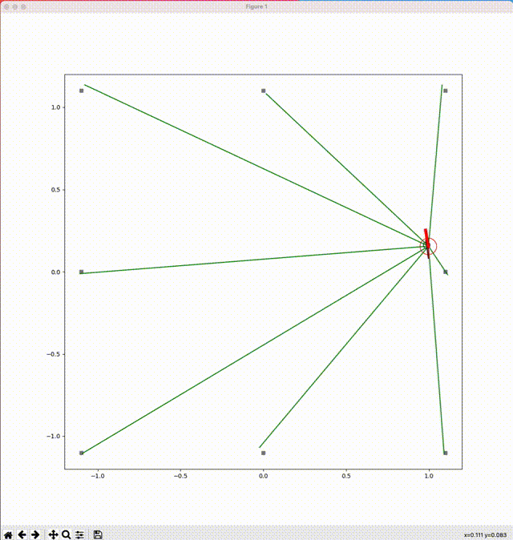
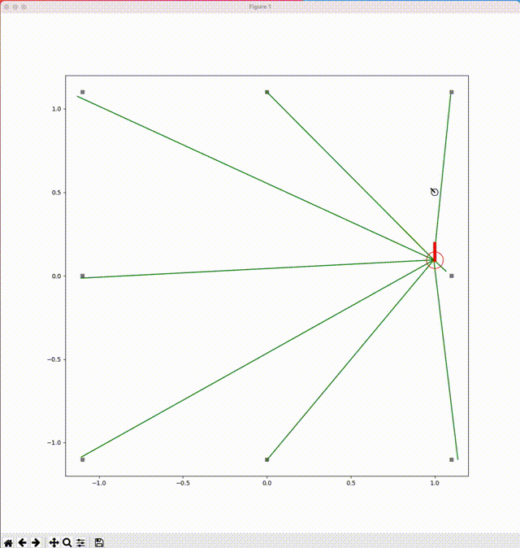

# robot\_simulator\_rust
A simulator of an autonomous mobile robot which estimates its pose by using Extended Kalman Filter and calculates control input by using Dynamic Window Approach.

## description
This program simulates an differential-drive wheeled autonomous robot like below:

* the state of robot: (x, y, θ)
* the control inputs: (v, ω) v=linear velocity, ω=angular velocity


This robot equips a 360-degree camera, and it can observe the distance and angle to the marker on environments.


## simulation
### circular route
This robot chases a target which moves on a circle.

* target: black object and black line
* actual trajectory: blue line
* observed mark: green lines
* estimated pose: red object
* estimated trajectory: red line



### square route
This robot chases a target which moves on a square.

* target: black object and black line
* actual trajectory: blue line
* observed mark: green lines
* estimated pose: red object
* estimated trajectory: red line


### waypoints trace
This robot traces a given waypoints.

* target: black object and black line
* actual trajectory: blue line
* observed mark: green lines
* estimated pose: red object
* estimated trajectory: red line




## how to use (on macOS Catalina)
### start plogger
1. clone `robot_simulator (python PJ)`

    ```
    git clone https://github.com/nmatsui/robot_simulator
    ```
1. install python 3.9 and dependent libraries by referring to [README of `robot_simulator`](https://github.com/nmatsui/robot_simulator/blob/main/README.md)
1. start plotter

    ```
    pipenv run plotter
    ```
### start agent
1. build a release binary

    ```
    cargo build --release
    ```
1. start the binary with the agent type (`circular`, `square` or `waypoints`)

    ```
    ./target/release/robot_simulator_rust circular
    ```

    or
    ```
    ./target/release/robot_simulator_rust square
    ```

    or
    ```
    ./target/release/robot_simulator_rust waypoints
    ```

## background
### state-space model
* [state-space\_model.md](docs/state-space_model.md)

### pose estimation using EKF
* [ekf.md](docs/ekf.md)

### local path planning
* [local\_path\_planning.md](docs/local_path_planning.md)

## license
[BSD 3-Clause License](./LICENSE)

## copyright
Copyright (c) 2021, [Nobuyuki Matsui](mailto:nobuyuki.matsui@gmail.com)

