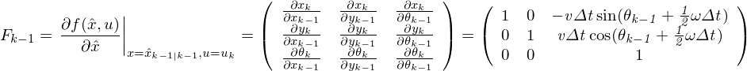
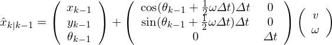
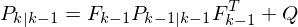
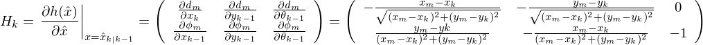
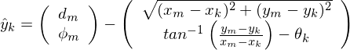
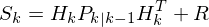
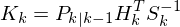
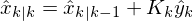
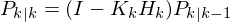

## pose estimation using EKF
### predict step

Jacobian of state equation is like below:

#### (1) predict pose

#### (2) predict covariance

Here **Q** is the covariance of the process noises (**wk**) which is assumed to be zero mean multivariate Gaussian noise.  
In this simulation, **Q** is an fixed matrix.

### update step

Jacobian of observation equation is like below:

#### (3) calculate measurement residual

#### (4) calculate residual covariance

Here **R** is the covariance of the observation noises (**vk**) which is assumed to be zero mean multivariate Gaussian noise.  
In this simulation, **R** is an fixed matrix.

#### (5) calculate Kalman Gain

#### (6) update pose

#### (7) update covariance

