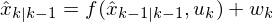
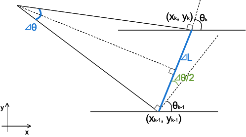
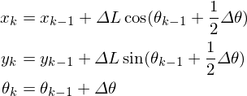
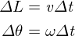
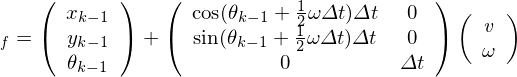
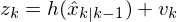
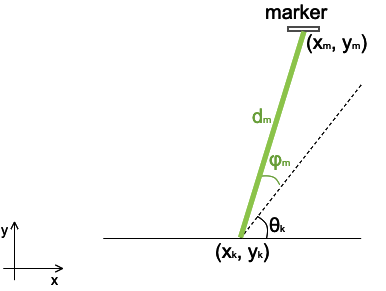
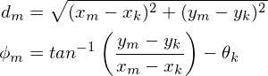

## state-space model
### state equation

The state equation is described like below:

where **wk** is the process noise.

Assuming that the ω is small, the following model approximates the robot's motion.

When **⊿t** is defined as the tiem difference from k-1 to k, **⊿L** and **⊿θ** is defined like below:

So *f* is defined like below:

### observation equation

The observation equation is described like below:

where **vk** is the observation noise.

